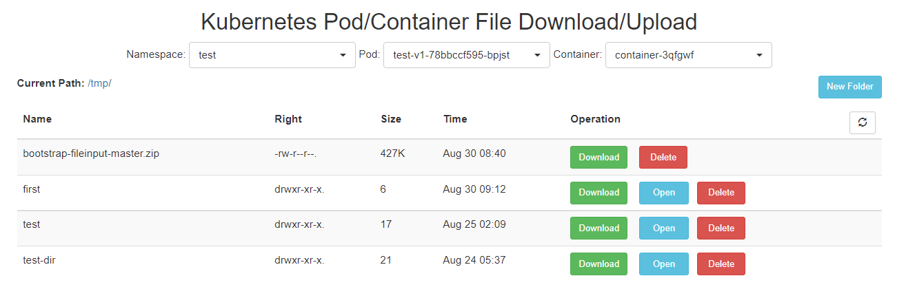

## get k8s token
1. create SA `kubectl create serviceaccount --namespace kube-system lg `
2. create rolebinding `kubectl create clusterrolebinding lg-admin --clusterrole=cluster-admin --serviceaccount=kube-system:lg`
3. get token 
```
kubectl describe secrets -n kube-system `kubectl describe sa lg -n kube-system |grep Token|awk '{print $2}'`|grep token: |awk '{print $2}'
```

## masterUrl
`https://[master ip]:6443` eg. `https://192.168.3.13:6443` .

## start
```bash
docker run -d --name kube-filesystem -e KUBE_MASTER_URL=xxx -e KUBE_TOKEN=xxx -p 8080:8080 hub.deri.org.cn/library/kube-filesystem:v1.0.0
```
## open
open in the browser use your ip, like `http://127.0.0.1:8080`

## feature
- Drag the file into the browser to upload
- download the file or folder
- create new folder
- delete file or folder

## tool
